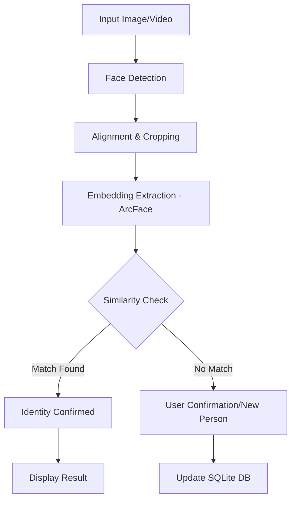

# Face Recognition AI 👤🚀

[](https://www.python.org/)
[](https://github.com/deepinsight/insightface)
[](https://www.sqlite.org/)
[](LICENSE)

A state-of-the-art, **Incremental Face Recognition System** designed for high-accuracy detection and real-time learning. This project leverages the powerful **ArcFace** architecture via the InsightFace library to provide a robust solution for managing and recognizing identities.

---

## 📺 Demo Video
Check out the system in action:

[**Watch the Demo Video**](./demo.mp4)

---

## 🌟 Key Features

### 🧠 Incremental Learning
Unlike traditional systems that require retraining, this system can **learn new faces on the fly**. When an unknown face is detected, you can instantly add it to the database or confirm a low-confidence match.

### 🎯 State-of-the-Art Accuracy
- Uses the **`buffalo_l`** model from InsightFace for superior detection and feature extraction.
- High-dimensional **512-D embeddings** ensure precise matching even with variations in lighting or pose.

### 🗄️ Robust Data Management
- **SQLite Backend**: All embeddings, person details, and training logs are stored in a local `face_embeddings.db`.
- **Image History**: Maintains a history of processed images to avoid redundant work.
- **Dataset Sync**: Easily import and process existing datasets in bulk.

### 📹 Real-time Capabilities
- Live recognition from **Webcam** feeds.
- Processing for pre-recorded **Video Files**.
- **REST API** support via `server.py` for integration into web or mobile apps.

---

## 🛠️ Tech Stack

- **Core Engine**: InsightFace (ArcFace Architecture)
- **Computer Vision**: OpenCV (cv2)
- **Data Science**: NumPy, Scikit-learn (Cosine Similarity)
- **Database**: SQLite3
- **Visualization**: Matplotlib

---

## 🚀 Installation & Setup

### 1. Prerequisites
Ensure you have Python 3.9 or higher installed.

### 2. Clone the Repository
```bash
git clone https://github.com/AURA-stack-svg/Face_Recognition_AI.git
cd Face_Recognition_AI
```

### 3. Install Dependencies
It is recommended to use a virtual environment:
```bash
# Create virtual environment
python -m venv venv
source venv/bin/activate  # On Windows: venv\Scripts\activate

# Install requirements
pip install -r requirements.txt
```

---

## 📖 Usage Guide

### ⚡ Interactive CLI
Run the main system to access the training and recognition menu:
```bash
python face_recognition_system.py
```
**Menu Options:**
1. **Train on dataset**: Bulk process a folder of images.
2. **Process single image**: Detect and identify faces in one file.
3. **Start video recognition**: Launch webcam or video file analysis.
4. **View statistics**: See database stats and known people.

### 🌐 Running the Server
To use the face recognition system as a backend service:
```bash
python server.py
```

---

## 🧠 System Architecture



---

## 📁 Project Structure

| File/Folder | Description |
| :--- | :--- |
| `face_recognition_system.py` | Main logic for detection, database, and CLI. |
| `server.py` | Flask/API wrapper for remote recognition. |
| `dataset_arcface/` | Local storage for cropped face samples. |
| `face_embeddings.db` | SQLite database for embeddings and logs. |
| `requirements.txt` | List of Python dependencies. |

---

## 🤝 Contributing
Contributions are what make the open-source community such an amazing place to learn, inspire, and create. Any contributions you make are **greatly appreciated**.

1. Fork the Project
2. Create your Feature Branch (`git checkout -b feature/AmazingFeature`)
3. Commit your Changes (`git commit -m 'Add some AmazingFeature'`)
4. Push to the Branch (`git push origin feature/AmazingFeature`)
5. Open a Pull Request

---

## 📄 License
Distributed under the MIT License. See `LICENSE` for more information.

---

**Developed with ❤️ by [Shivam Kharat](https://github.com/shivamkharat)**
